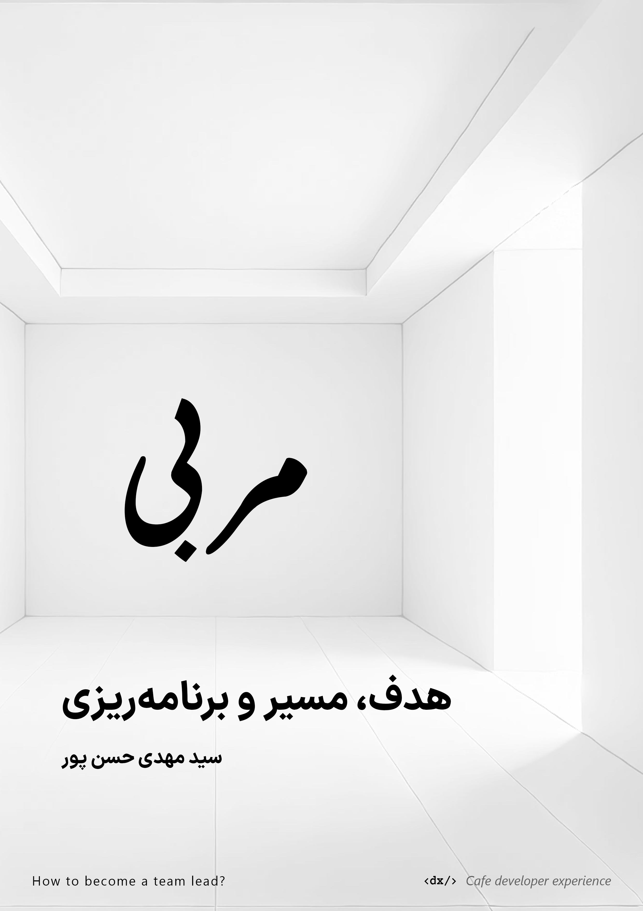

بسم الله الرحمن الرحیم

 

سایر زبانها: [English](./readme-en.md)

# مجموعه کتاب مربی فرانت‌اند – چطور یه رهبر تیم بشیم

> ||| راهنمای گمشده برای اینکه به روش درست به یک تیم‌لید تبدیل بشیم |||

این مجموعه کتاب می‌خواد بهتون نشون بده چطور می‌تونید مسیر درست مطابق با شرایطتتون (از بین هزاران مسیر ممکن) رو برای رشد کردن به سمت رهبر تیم شدن پیدا کنید و از راه‌های اشتباه دور بمونید.

## عناوین کتاب

پیشنهادمون اینه که کتاب‌های «مربی» رو به ترتیب زیر بخونید:

1. **مربی: هدف، مسیر، منابع و برنامه‌ریزی** – [دانلود](https://github.com/SeyyedKhandon/coach/releases/download/v1.0.0/Frontend.Coach-goal-path-planning-TeamLead.the.Right.Way.-.ch1-ed1-12jan2025-github-release-v1.0.0.pdf)
2. **راهنمای گمشده برای فعالیت در جامعه های تخصصی** – (نسخه پیش‌نویسش [اینجاست](https://github.com/SeyyedKhandon/stackoverflow-the-right-way))
3. **آماده‌سازی محیط کار حرفه ای و راه‌اندازی یه پروژه** – (در حال نگارش پیش‌نویس)
4. **کلید گمشده برای استخدام و رشد: ارتباط (لینکدین، رزومه، درخواست کار)** – (در حال نگارش پیش‌نویس)

## تو هم یه گوشه‌ای از آینده باش

اگه دوست داری آینده رو بسازی، می‌تونی با [حمایت](./support.md) و همکاری در مجموعه کتاب‌های مربی، رد پات رو توی آینده بذاری.

### چطور همکاری کنی:

ما از فرانت‌اند شروع کردیم. مثلاً تو کتاب اول، منابعی داریم که برای همه زمینه‌ها مفیده ولی یه بخش تخصصی هم برای فرانت‌اند داره. این یعنی فضا برای اضافه کردن تخصص‌های دیگه مثل بک‌اند، دواپس و غیره هم بازه.

پس اگه حوزه کاریت فرانت‌اند هم نیست، باز هم می‌تونی کمک کنی. مثلاً اگه منابع باارزشی تو بک‌اند(مانند توسعه بک‌اند با Java، Python، Rust و غیره) یا هر زمینه دیگه می‌شناسی، خوشحال می‌شیم اون‌ها رو در قالب RFC در یک [issue](https://github.com/SeyyedKhandon/coach/issues) ثبت کنی تا وقتی که به وضعیت تایید رسید اونا رو به [مجموعه](other-topics.md) اضافه کنیم.

هدفمون اینه که این پروژه رو گسترش بدیم و همه حوزه‌ها رو پوشش بدیم تا راهنمای جامعی بشه برای همه آدم‌ها و هر چیزی که می‌تونه به پیشرفت زندگی ما آدم‌ها کمک کنه.

[مشارکت / Git Flow](./contribution.md)

#### مشارکت کنندگان اصلی

<table>
  <tbody>
    <tr>
      <td align="center" valign="top" width="25.28%">
        <a href="https://github.com/seyyedkhandon">
          
           
          <b>سید مهدی حسن پور-مولف</b>
        </a>
         
        <a href="https://seyyedkhandon.com/" title="Code">💻</a>
      </td>
       <td align="center" valign="top" width="25.28%">
        <a href="https://github.com/ZahraMirzaei">
          
           
          <b>زهرا میرزایی - ویراستار</b>
        </a>
      </td>
      <td align="center" valign="top" width="25.28%">
        <a href="https://github.com/Coderx7">
          
           
          <b>سید حسین حسن پور-حامی</b>
        </a>
         
        <a href="https://deeplearning.ir/" title="Code">💻</a>
      </td>
      <td align="center" valign="top" width="25.28%">
        <a href="https://github.com/hamedlokik">
          
           
          <b>هامان نقی نیارمی - طراح</b>
        </a>
      </td>
    </tr>
</tbody>
</table>

## مجوز و حق نشر

تمام حقوق این مجموعه متعلق به سید مهدی حسن‌پور (SeyyedKhandon) است.

 این اثر تحت مجوز  <a rel="license" href="http://creativecommons.org/licenses/by-nc-nd/4.0/">Attribution-NonCommercial-NoDerivatives 4.0 International</a>  منتشر شده است.

