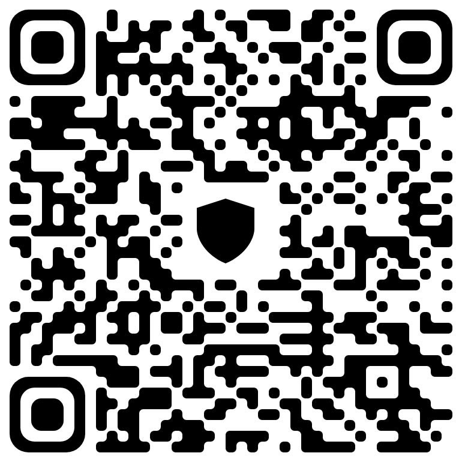
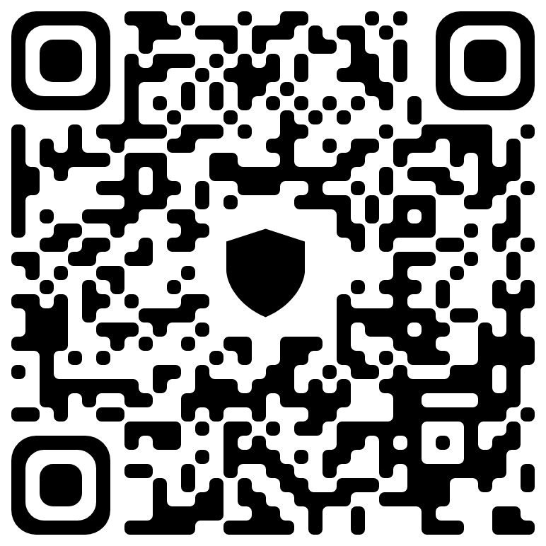

# Your support will helps us to continue this work

In 2021, this project started as a dream—to share knowledge and help others grow the right way. After years of effort, we’re thrilled to announce the release of the first version of our book—a guide built from countless lessons learned.

But this is just the beginning. There’s so much more we want to create—tools, ideas, and resources to empower you. Yet, like many open-source efforts, we face the challenge of limited time and funding.

By donating, you’re not just supporting this project; you’re becoming part of a cycle where we help each other grow. Let’s keep this journey alive, together and have an everlasting effect on the future:

## Funding support:

- Bitcoin(btc): `bc1q46yjwqmfr24jcuyhpn4ytw43jg574vrgas0nms`

>  

 
 
 

- Tron(trx): `TXmrBDhHkajqAiPsbYCn9xFdeg5XAfK61x`

>  

 
 
 

- Dogecoin(DOGE): `DSDkF73VLBdmjfwunHsJRMPzU2tcXXbsjN`

>  

 
 
 

- Monero(xmr): `45fK4VrJgq9RK5vNYhpbzL5HgSDAun2Hp7ixdnEp3dtAEKLjmMn897QZh4ci94BpLuawBLp611aXnSs456LhXDV369kBskD`

 
 
 

- Cardano(ADA): `addr1q8sa8m709v47285krx52uk58qf5gezn5d6amxg85gh45cancfwpzzst964gxzml6qjt939xy8n7urjqj39ryurgrzypsfhlcf7`

>  

 
 
 

- Toncoin(TON): `UQAKrYoppMs_ooWKKGHoadmBvqg5Bt1lBRAt-k9d0v2dN_Hp`

>  

 
 
 

- Tether(USDT on TRC20): `TXmrBDhHkajqAiPsbYCn9xFdeg5XAfK61x`

>  

 
 
 

- Solana(SOL): `FSExYexecD77DNqNFbf1mRop9L7Hss7hYPcNwhQyVMVZ`

>  

 
 
 

- Ripple(XRP): `rpkdAtfs5EkcdPVXjVk9QeCGhJgqQ39Phw`

>  

 
 
 

- Zcash(ZEC): `t1ZfXPrY6qVWG3QvCrVwxNiwN4WTAVHXCw8`

>  

 
 
 

- Internet Computer(ICP): `707b1808f79b1ab219dda84a2f3da47332c14a9a916063f7c1a08a89cd036560`

>  

 
 
 

- Binance Smart Chain(BNB): `0x44A852972BD3E95379641A9427b740Cd1f95f95F`

>  

 
 
 

- Ethereum(eth): `0x44A852972BD3E95379641A9427b740Cd1f95f95F`

>  

## Lending a hand:

You can support this project by simply giving a star on github, contributing to the project, helping on the translation to other languages especially english, help us making the video/audio books, sharing it with your friends, and spreading the word about it, all of which help us to continue this work.

If you’re interested in contributing, please check out our [contribution guidelines](./contribution.md).

Thank you for your support!
